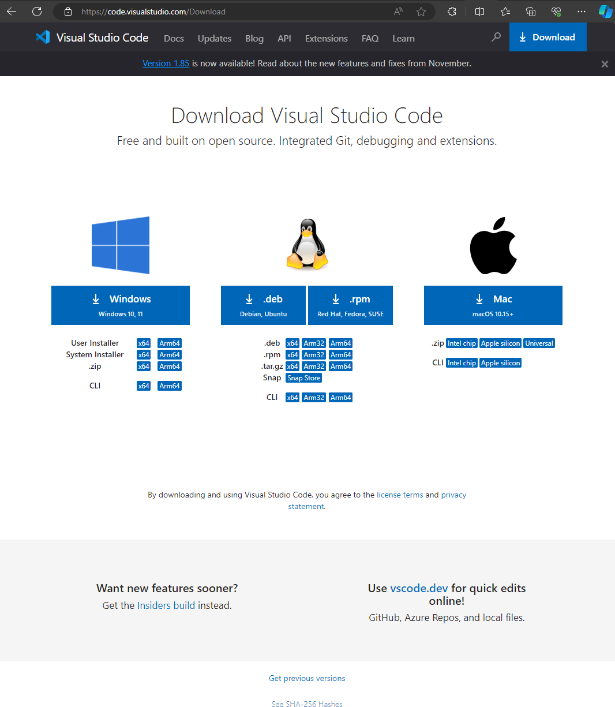
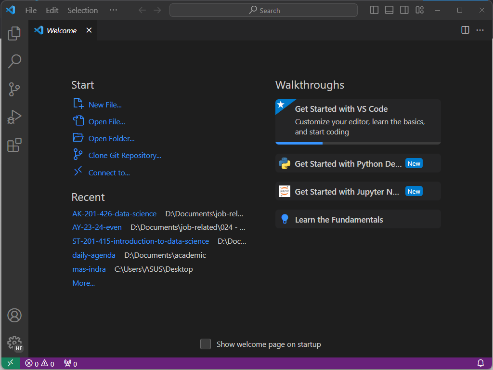
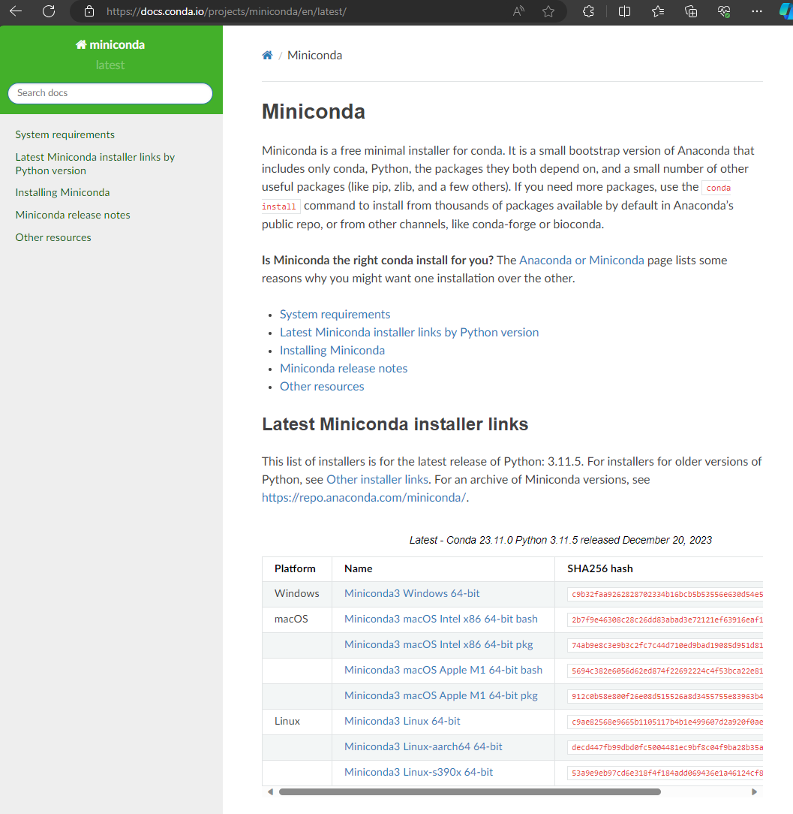
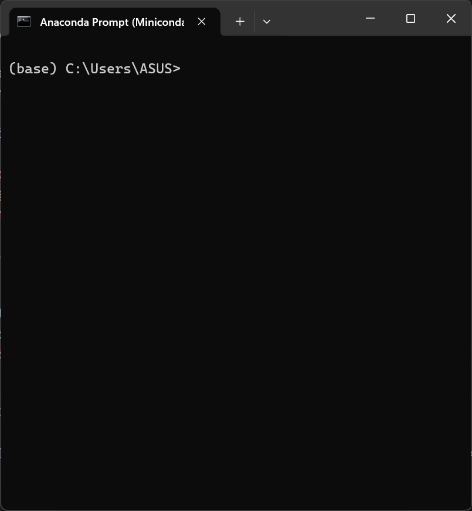
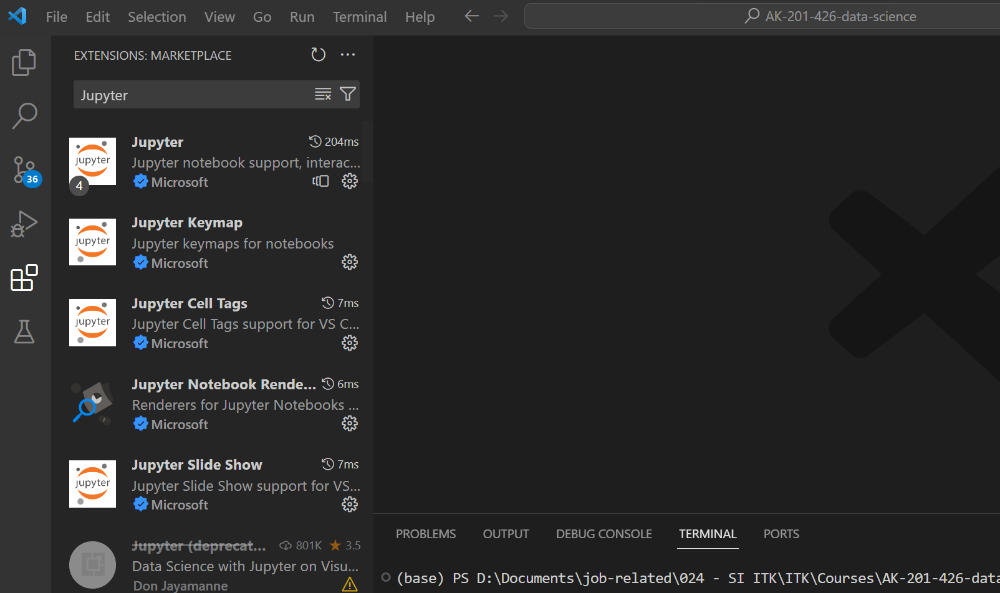
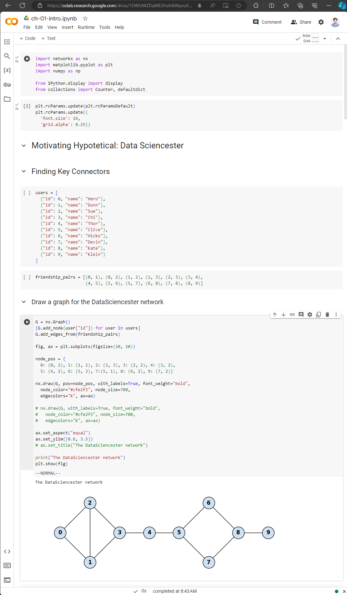

# Notes - Week 01 - Introduction and installation

Lecturer: **Henokh Lugo Hariyanto**

> The tips for learning how to code with Python for this lecture is you should 
> rewrite all the codes. After that you should play around by modifying all the values,
> input parameters, and other settings. By looking at the behavior of after you 
> re run the program for several times, you should understand the mechanism and
> functionality of each code in a part of whole program.

This note is short version and summary of (Gruz, 2019). Most of the codes and texts are
excerpt from that book.

## VSCode installation

To learn all the material in this lecture, we need to install VSCode as the 
code editor. Why we choose VSCode because it supports to edit and run 
Jupyter notebook which is a program that we will use a lot during the lecture.

The following tutorial for installation is for Windows' user.

1. First download VSCode installer from this link: [https://code.visualstudio.com/Download](https://code.visualstudio.com/Download), and choose Windows 10 or 11 installer
   
   
   
2. Follow the instruction without customized any setting (click Next or Yes).
   After the installation, you will have the welcome page (or open the
   VSCode application if it has not already opened yet)

   

And now you have VSCode installed in your PC. The next step is to install
Python through Miniconda environment.

## Miniconda
To create a project using Python, sometimes we need a specific dependencies
for a given library. To resolve this issue, there is a program to isolate
our project such that it contains specific version of Python and related
Python packages/libraries/modules that is compatible with the Python installed
in our computer.

Miniconda which is the smaller version of Anaconda program, gives us
a minimalist installed Python and its libraries (the libraries or packages in 
Python are called modules). You can find later that we can create as many as
we want the number of environment for each project to isolate the 
dependencies of Python's modules. This is very convinience when you are working
with different people and a lot of project that need different version of
Python and its modules.

We only provide the installation for Windows' user. 

1. Go to this link of Miniconda download page: [https://docs.conda.io/projects/miniconda/en/latest/](https://docs.conda.io/projects/miniconda/en/latest/).
   Select `Miniconda3 Windows 64-bit`.

   

2. [optional] If you want to make sure that your downloaded installer
   is an installer of Miniconda, you can check the SHA256 has of
   the downloaded file. To do that, go to the location where of your downloaded
   file. Open the terminal or PowerShell, and type this command:
   ```bat
   Get-FileHash .\Miniconda3-latest-Windows-x86_64.exe -Algorithm SHA256
   ```
   Then check the output it is the same or not to the SHA256 has number
   in the download page of Miniconda. If it is not, you have a trouble
   and you must not install the program.

3. Double click the `.exe` of Miniconda, and follow the instruction on the 
   screen. Accept the defaults if you are unsure about any setting.

4. After the installation, you should be able to find a program 
   with title "Anaconda Prompt (Miniconda3)". Open that program
   to initiate conda base environment.

   


Now, you have installed VSCode and Python (through miniconda). The next
step to install extension (including Jupyter notebook) and other 
Python modules in the miniconda.

## VSCode extension

This step is needed to make your VSCode supports opening, editing, and running
Jupyter Notebook (and two other extensions). 
In this section, we have to install these extensions:
1. Jupyter (by Microsoft)
2. Python (by Microsoft)
3. Markdown Preview Github Styling (by Matt Bierner)

Please make sure that you install the extension from the developer that I have
mentioned above. There are many extension with the same name but created by
different developer

These are the steps and I only showed for the installation of the Jupyter extension.
The other extensions follow the same steps:
1. Open the VSCode program, and on the left side of VSCode 
   click Extension icon (there is an icon
   with four block of square where the subblock in the top right is popped out).

   

2. Then in the search box, type: "Jupyter"
3. Click blue button "Install" to proceed the installation of the Jupyter extension.
4. After finish the installation, or you can do at the same time without waiting
   this extension finishes its installation, install the two other extensions.

At this point, you have installed all the basic requirement to open, edit, and
run Jupyter Notebook file `.ipynb`.

## Google Colab

If you intend to use Google Colab, you do not need to install VSCode and Miniconda 
to your computer and also all the Python packages. 
You only need to have a Gmail account (using ITK student email account).
Copy all the `.ipynb` file to your GDrive and open it with Google Colab.

